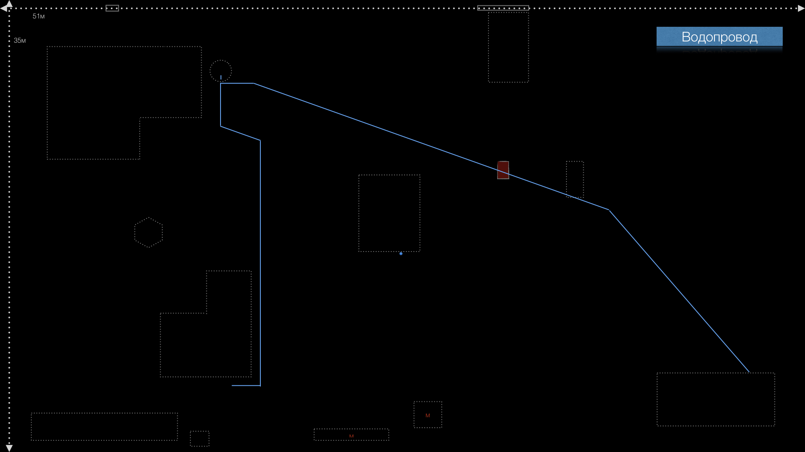

<nav id="navi"><!-- js --></nav>

# Водопровод

*Инструкция пользователя…*

### Схема водопроводной трассы

Водопровод начинается от колодца. От колодца вода разводится в три точки: Дом, Баня, Сарай.

## Точка первая — Дом

Первый водопровод проложен в дом 90 корпус 1.
За этим водопроводом не нужно следить в моменты заморозков и зимой если дом отапливается, так как водопровод до дома оборудован саморегулируемым кабелем обогрева проложенным внутри трубы. Труба утеплена, система оборудована термостатом, который включается при температуре ниже 0°. Этим кабелем также обогревается бокс насосной станции, установленный в домике колодца. Насос и кабель подключены в боксе. Бокс утеплен и подключен к розетке на колодце под [гребенкой](https://www.google.com/search?q=гребенка+воды&tbm=isch&ved=2ahUKEwieieqy16eCAxUjHRAIHYc7BXAQ2-cCegQIABAA&oq=гребенка+воды&gs_lcp=CgNpbWcQAzIFCAAQgAQyBggAEAgQHjIGCAAQCBAeMgYIABAIEB46BAgjECc6BwgAEIoFEEM6BwgAEBgQgARQgAdYiA9g6RFoAHAAeACAAY0BiAHgBZIBAzAuNpgBAKABAaoBC2d3cy13aXotaW1nwAEB&sclient=img&ei=o9NEZd6rIqO6wPAPh_eUgAc&bih=699&biw=1280&hl=RU).

Колодец должен быть всегда подключен к электрической сети.

Часть водопровода проходит внутри дома и также требует слива воды из системы, если дом не будет отапливаться при морозах. Вы не можете оставить включённым колодец и отключить в доме отопление в холодное время года. Если вы хотите отключить дом от электричества, обогрева, вы должны слить остаток воды который находится в доме. Для этого нужно продуть систему сжатым воздухом *(читай ниже…)*, предварительно открыв кран горячей воды. Через этот кран сольётся вся вода, которая находится в водонагревателе дома.

## Точка вторая — Баня

Второй водопровод проложен к бане. Водопроводной канал закопан на глубину **70см** без стыков – одной трубой диаметром **32мм**. Этот водопровод нуждается в продувке при наступлении заморозков. Также в бане находится водонагреватель и бак нагрева воды над печкой. Все данные приборы включая и подходящие трубы должны быть продуты сжатым воздухом из компрессора с давлением не более 3-х атмосфер.

> Данные водопровод снабжен кабелем обогрева 10 Вт на метр. Питание кабеля подается от колодца. Обогрев водопровода снабжен регулятором напряжения и контролем уровня (наличия) воды.

### Последовательность действий.

> ИДИТЕ В БАНЮ и ОТКЛЮЧИТЕ ВОДОНАГРЕВАТЕЛЬ ОТ СЕТИ. ПОВЕРНИТЕ РЕГУЛЯТОР ВОДОНАГРЕВАТЕЛЯ ВЛЕВО ДО УПОРА:

    1. Режим ` E ` - включено
    2. Положение ` • ` - выключено

Вернитесь к колодцу. Внутри домика колодца, в самой нижней точке, которая
утеплена, внутри находится сливной кран со сливным приспособлением.

Перекройте этот жесткий кран по часовой стрелке (зеленая стрелка на фото). В самом конце нам придется снова вернуться в эту утепленную точку.
Вы отключили вторую и третью точки подачи воды (баню и сарай). Далее требуется продуть отключённые части водяной системы сжатым воздухом. Последовательность шагов указана ниже.

Откройте смеситель в бане. Оставьте их открытыми.

Включите компрессор находящийся в сарае в электрическую сеть, он должен набрать в себя воздух и отключиться. Подсоедините к нему продувной резиновый шланг с пистолетом. Воткните штуцер шланга в компрессор. Подсоедините к крану третьей точки у сарая спецшланг.

Если специального шланга не найдено, тогда вставьте продувочный пистолет в отверстие выхода воды и прижав направьте воздух в трубу нажав на курок пистолета.  Вода начнёт выталкиваться воздухом в сторону бани и сливаться через смеситель в бане. Эта процедура обычно занимает две или три минуты. Ждите… Компресор может снова подкачивать воздух.

1. Отправляйтесь в баню.
2. В бане откройте водопроводный смеситель.
3. Долее откройте кран под водонагревателем и дайте слиться всей воде в раковину, дождитесь полного слива воды. Это может длиться по времени до 10-15 минут рывками.

1. Слейте воду из бака над печкой через подсоединяемый шланг в душевую кабину.
2. Слейте воду из бака в летнем душе.

После слития воды **закройте** все краны и смесители на зимний период. Краны и смесители должны быть всегда в закрытом состоянии.

## Остатки воды

Вернитесь к колодцу чтобы слить остаток воды из фильтра и остатков воды ниже фильтра. Для этого в самый нижней утепленной точке, в сливном кране отрутите против часовой стрелки вентилёк (желтая стрелка на фото) и дождитесь слива остатков воды прямо в колодец. Закрутите по часовой стрелке вентилек без усилия. 

 **!!! После слива воды реле автоматически отключит кабель обогрева, который проложен внутри трубы**.

**Система готова зимовать**.

## **Пользование баней в зимнее время**

Водопровод в баню снабжен кабелем обогрева труб. Если вам понадобится зимой включить воду, вам потребуется просто открыть кран в утепленном узле. Когда вода в фильтре достигнет нужного уровня сработает датчика обогрева водопровода и включится напряжение на кабель обогрева. По окончании использования водопровод можно оставить с обогревом или продуть трассу сжатым воздухом, предварительно перекрыв  в теплом узле. Как только вода покинет водопровод датчик уровня воды отключат питание кабеля автоматически.

> Важно знать и помнить, что кабелем обогревается только водопровод до гребенки, которая находится в бане. Если вы сольете воду только с водопровода, тогда в бане останется вода в водонагревателе, которая замерзнет при отрицательных температурах и повредит оборудование.

<!--ystm_start-->
 

 ||||
 |:---|:---:|---:|
 [←——](readme.md)|[🔝](#)|[——→](002-energy.md)

  
<!--ystm_end-->
