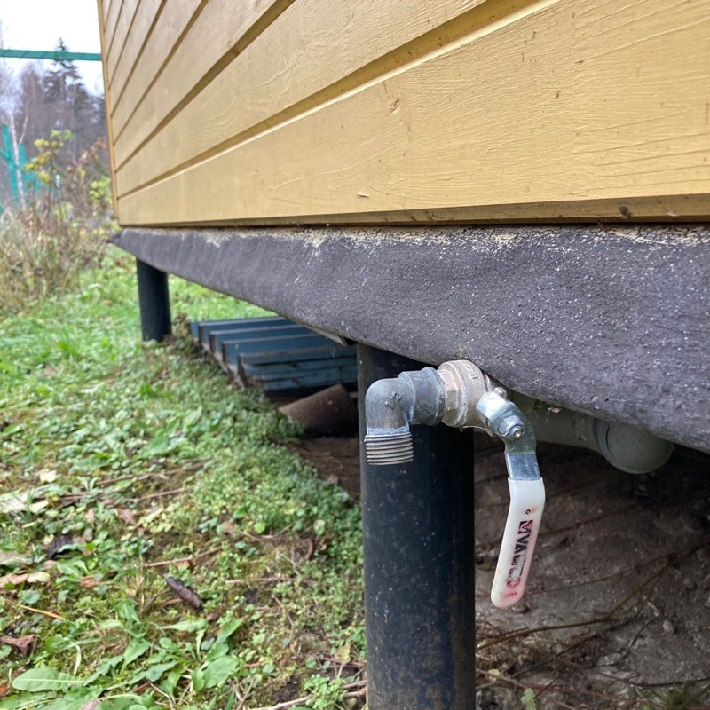

<nav id="navi"><!-- js --></nav>

# Водопровод 

*Инструкция пользователя…*

### Схема водопроводной трассы

Водопровод начинается от колодца. От колодца вода разводится в три точки: Дом, Баня, Сарай.

## Точка первая — Дом

Первый водопровод проложен в дом 90 корпус 1. 
За этим водопроводом не нужно следить в моменты заморозков и зимой, так как он оборудован саморегулируемым кабелем обогрева проложенным внутри трубы. Труба утеплена, система оборудована термостатом, который включается при температуре ниже 0°. Этим кабелем также обогревается бокс насосной станции, установленный в домике колодца. Насос и кабель подключены в боксе. Бокс утеплен и подключен к розетке на колодце под [гребенкой](https://www.google.com/search?q=гребенка+воды&tbm=isch&ved=2ahUKEwieieqy16eCAxUjHRAIHYc7BXAQ2-cCegQIABAA&oq=гребенка+воды&gs_lcp=CgNpbWcQAzIFCAAQgAQyBggAEAgQHjIGCAAQCBAeMgYIABAIEB46BAgjECc6BwgAEIoFEEM6BwgAEBgQgARQgAdYiA9g6RFoAHAAeACAAY0BiAHgBZIBAzAuNpgBAKABAaoBC2d3cy13aXotaW1nwAEB&sclient=img&ei=o9NEZd6rIqO6wPAPh_eUgAc&bih=699&biw=1280&hl=RU).

 Колодец должен быть всегда подключен к электрической сети.

## Точка вторая — Баня

Второй водопровод проложен к бане. Водопроводной канал закопан на глубину **70см** без стыков – одной трубой диаметром **32мм**. Этот водопровод нуждается в продувке при наступлении заморозков. Также в бане находится водонагреватель и бак нагрева воды над печкой. Все данные приборы включая и подходящие трубы должны быть продуты сжатым воздухом из компрессора с давлением не более 3-х атмосфер. 

Последовательность действий.

>ИДИТЕ В БАНЮ и ОТКЛЮЧИТЕ ВОДОНАГРЕВАТЕЛЬ ОТ СЕТИ.

Поверните регулятор водонагревателя влево до упора:

    1. Режим ` E ` - включено
    2. Положение ` • ` - выключено

Вернитесь к колодцу. Внутри домика колодца, в самый нижний точке, которая утеплена, внутри находится сливной кран со сливным приспособлением. 

Перекройте этот жесткий кран по часовой стрелке (зеленая стрелка на фото). В самом конце нам придется снова вернуться в эту утепленную точку. 
Вы отключили вторую и третью точки подачи воды (баню и сарай). Далее требуется продуть отключённые части водяной системы сжатым воздухом. Последовательность шагов указана ниже.

Откройте смеситель в бане и кран у сарая. Оставьте их открытыми.

Включите компрессор находящийся в сарае в электрическую сеть, он должен набрать в себя воздух и отключиться. Подсоедините к нему продувной резиновый шланг с пистолетом. Воткните штуцер шланга в компрессор. Подсоедините к крану третьей точки у сарая спецшланг. 

Если специального шланга не найдено, тогда вставьте продувочный пистолет в отверстие выхода воды и прижав направьте воздух в трубу нажав на курок пистолета.  Вода начнёт выталкиваться воздухом в сторону бани и сливаться через смеситель в бане. Эта процедура обычно занимает две или три минуты. Ждите… Компресор может снова подкачивать воздух. 

Подойдите к колодцу и закройте большой кран на домике колодца и средний краник на гребенке от белой трубы ведущей к сараю. Положение закрыто считается как на фото, то есть ручка крана расположена поперек трубы.

Отправляйтесь в баню.

В бане откройте водопроводный смеситель. 
Откройте кран под водонагревателем и дайте слиться всей воде в раковину, дождитесь полного слива воды. Это может длиться по времени до 10-15 минут рывками.

1. Слейте воду из бака над печкой через подсоединяемый шланг в душевую кабину.
2. Слейте воду из бака в летнем душе.

После слития воды **закройте** все краны и смесители на зимний период. Краны и смесители должны быть всегда в закрытом состоянии. 

## Остатки воды

Вернитесь к колодцу чтобы слить остаток воды из фильтра и остатков воды ниже фильтра. Для этого в самый нижней утепленной точке, в сливном кране отрутите против часовой стрелки вентилёк (желтая стрелка на фото) и  дождитесь слива остатков воды прямо в колодец. Закрутите по часовой стрелке вентилек без усилия. 

Удалите старый фильтр с помощью накидного ключа, открутив фланец колбы ключом против часовой стрелки. Соберите все обратно без фильтра.

**Система готова зимовать**.

