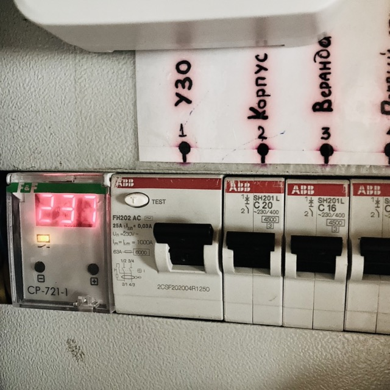
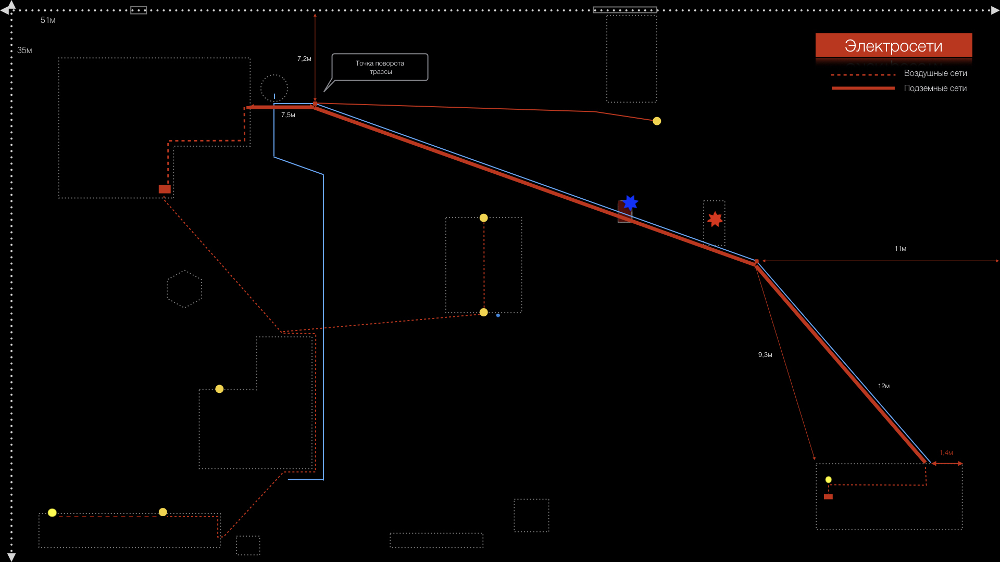

<nav id="navi"><!-- js --></nav>

# Электрооборудование 

*Инструкция пользователя…*

>ПАМЯТКА: Если где то на участке пропало электричество, то первым делом проверте автоматические выключатели в элетрическом щитке. Рабочее положение — **черная клавиша ВВЕРХ.**

## Общая схема электроснабжения участка. 

Электроснабжение подводится от столба на дороге, от счётчика установленного на верху столба. Доступ к счётчику получается через дистанционный информационный пульт, который находится в электрическом шкафу в доме.  

Нижний счётчик на столбе в шкафу  не используется для снятия показаний и имеет автомат для отключения участка от сети.  

Счётчик установленный в доме в электрическом шкафу, также НЕ используется для снятия показаний. Это предыдущие счётчики оставленные в электрической схеме подключения.   При надобности их можно демонтировать. 

Дом оборудован системой аварийного питания через генератор работающий на бензине. Бензин в генератор заливается чистый, без примесей марки А92. Переключения подачи электричество производится реверсивным переключателем установленным на электрическом шкафу с правой стороны. 

Если вам нужно подключить генератор, вы должны запустить его и после этого переключить реверсивный переключатель в нужное положение, который отключает подачу электроэнергии из общей сети, и подключает внутреннюю сеть дома к генератору. 

Реверсивный переключатель можно переключать в любом режиме всегда. Этот переключатель  отключает главную сеть электроснабжения идущую от столба и подключает электропитание идущее от генератора. 

Об обслуживании генератора читайте страницу - [Генератор](003-generator.md).

## Электрический обогрев дома

Для экономии электроэнергии второй этаж дома перекрывается осенью при температуре ниже +5° по Цельсию.

Дом обогревается конвекторами NOBO, которые имеют мощность от 500 до 1000 Вт. Конвекторы распределены таким образом чтобы снизить максимальную нагрузку на проводку дома. Конвекторы не связаны единым термостатом и системой управления. Не устанавливайте обогреватели с суммарной мощностью более 5.5 киловатт в доме. На конвекторах красной точкой отмечена температура зимнего режима, когда на улице ниже -5°. 

>Самый лучший вариант обогрева конвекторы по 500 Вт в количестве 10-11 штук расположенных по периметру строения.

Помните, что тепло в данном доме зависит от напряжения в общей электросети СНТ, а не только от регулятора и мощности конвектора.

Также в доме находится нагреватель воды бойлер, вместимостью 30 литров и мощностью 1500 Вт.. Проводка в доме выполнена гибким кабелем с сечением 2,5 квадрата. Вся электропроводка дома заземлена и защищена системой УЗО и реле-контроллером напряжения. Все розетки имеют заземляющий контакт.

## Синий дом

Не заземлен. 

Имеет первоначальную простейшую проводку. Светильник крыльца оборудован сумеречными регулируемым и нерегулируемым реле.

Холодильник данного синего дома иммеет температурный режим работы окружающей среды от +7°С и выше. Если температура опускается ниже +7°С холодильник желательно отключать от сети. Об этом напоминает световая желтая индикация на холодильнике.

## Сарай

 Сарай подключён кабелем с сечением 2,5 квадрата. 
 Сарай оборудован уличным светильником с датчиком движения и дистанционным переключателем на 4 канала.
 Электропроводка сарая заземлена.

## Баня

 Баня подключена к электрическому щитку кабелем с сечением 1.5 квадрата, проложенного в трубе ПВХ подземным способом на глубине 70 см. Вместе с электрокабелем, в трубе проложен телевизионный кабель с жилами питания. Часть трубы проложена от дома до домика генератора и вводится в домик, вторая часть трубы проложена от домика генератора до бани. Вместе с электрической трубой отмеченной красным маркером, проложена труба водоснабжения отмеченная синей линией на схеме.

Баня оборудована бойлером на 30 литров и мощностью 1.5 кВт. Также в бане установлен обогреватель Nobo мощностью 1.5 кВт. Баня защищена УЗО на 10 мА. 
Электропроводка бани заземлена.

Ночное освещение бани подключено через датчик движения.

## Освещение участка

Освещение участка выполнена воздушным способом – кабелем сечением 2,5 квадрата. Питание ведётся от дома к дому далее к сараю и ответвляется к беседке. Беседка оборудована светильниками, прожектором на мачте и светодиодной лентой с подключаемым контроллером. Вся система управляется по радиоканалу с пульта. Ночное освещение управляется сумеречными реле.

## Освещения автостоянки

К стоянке проложен подземный кабель без трубы. Кабель проложен от колодца до столба освещения на автостоянке перед воротами. Освещение автостоянки оборудовано датчиком движения.

Кабель старый, возраст около 50 лет.

## Мангал

Мангальная зона поключена к сараю кабелем с с сечением 1.5 квадрата. Имеет светильник.

### Схема электрической разводки на участке

1. Сплошной красной линией обозначается подземная трасса кабеля. 
2. Прерывистая линией обозначается проводка проложенная по воздуху. 
3. Голубой линией обозначен водоканал. Подробности по водопроводу можно узнать в [разделе вода](001-water.md).
4. Красной звездочкой обозначено место установки генератора мощностью ~7.5 киловатт.
5. Синей звездочкой обозначен колодец для доступа к трубам.
6. Желтым кружком отмечены уличные светильники.

<!--ystm_start-->
 

 |||| 
 |:---|:---:|---:| 
 [←——](001-water.md)|[ 🔝 ](#)|[——→](003-generator.md) 

  
<!--ystm_end-->
