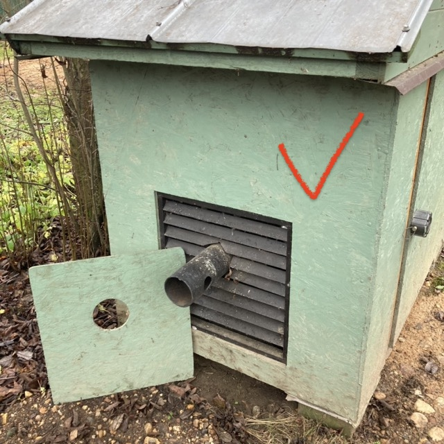
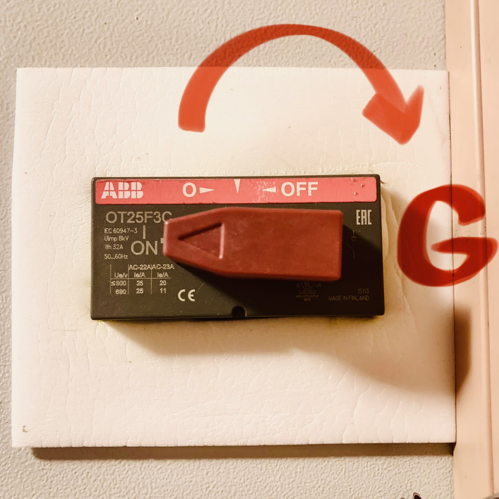

<nav id="navi"><!-- js --></nav>

# Генератор и его обслуживание

*Инструкция пользователя…*

[Инструкция генератора](assets/pdf/Briggs_and_Stratton.pdf)

Мощность генератора составляет 7.5 Киловатт. 

Генератор размещен в боксе, при его работе требуется открыть крышку вентеляционной решетки в районе выхлопной трубы и оставить дверь бокса открытой полностью. 

Произвести запуск генератора в соответствии с инструкцией.

Генератор заправляется бензином марок A95.

Замена масла в картере производится согласно инструкции по экплуатации девайса. Если генератор не используется, тогда замена масла производится раз в 4года.

Масло для генератора используется автомобильное, **синтетическое** марки **5W30** класс F.

Генератор оснащен стартером, но стартер не используется так как поддерживать аккумулятор в рабочем состоянии круглогодично не практично. Поэтому стартер запускается вручную кикстартером веревочным способом.

После запуска генератора нужно переключить реверсивный переключатель, установленный в доме на электроящике в режим генератора.

На картинке ниже выключатель находится в режиме обычного подключения к общей сети. Для подключения питания от генератора проверните красную ручку рубильнька со стрелкой в сторону нарисованной литеры `G`.

!!! ВАЖНО… НЕ пользуйтесь стиральной машиной находящийся в бане. Она будет некорректно работать из-за чуствительности электронники к нестабильно поступающему току от генератора.

||||
|:----|:-----:|---:|
[←——](002-energy.md)|[ 🔝 ](#)|[——→](004-gaz.md)

