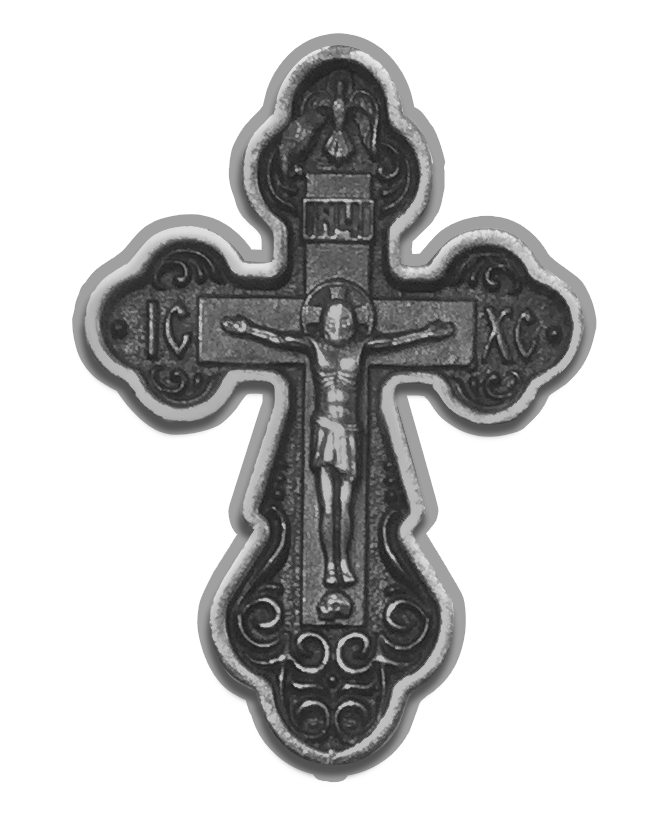

Во Имя Отца и Сына и Святаго Духа. Аминь.
 
**Молитвами святых отец наших, Господи Иисусе Христе Сыне Божий, помилуй нас. Аминь.**
 

Господи, Иисусе Христе Сыне Единородный безначального Твоего Отца, Ты бо рекл еси пречистыми усты Твоими: яко без Мене не можете творити ничесоже. Господи, мой Господи, верою объем в души моей и в сердце Тобою реченная, припадаю Твоей благоcти и молюся Ти: помози ми грешному дело мною начинаемое о Тебе Самом совершите, молитвами Богородицы и всех Твоих святых. Аминь.
 

<!--pagination_start-->
 
 |||| 
 |:---|:---:|---:| 
 [контакты](about.md)|[ 🔝 ](#)|[——→](contacts.md) 
  
<!--pagination_end-->
